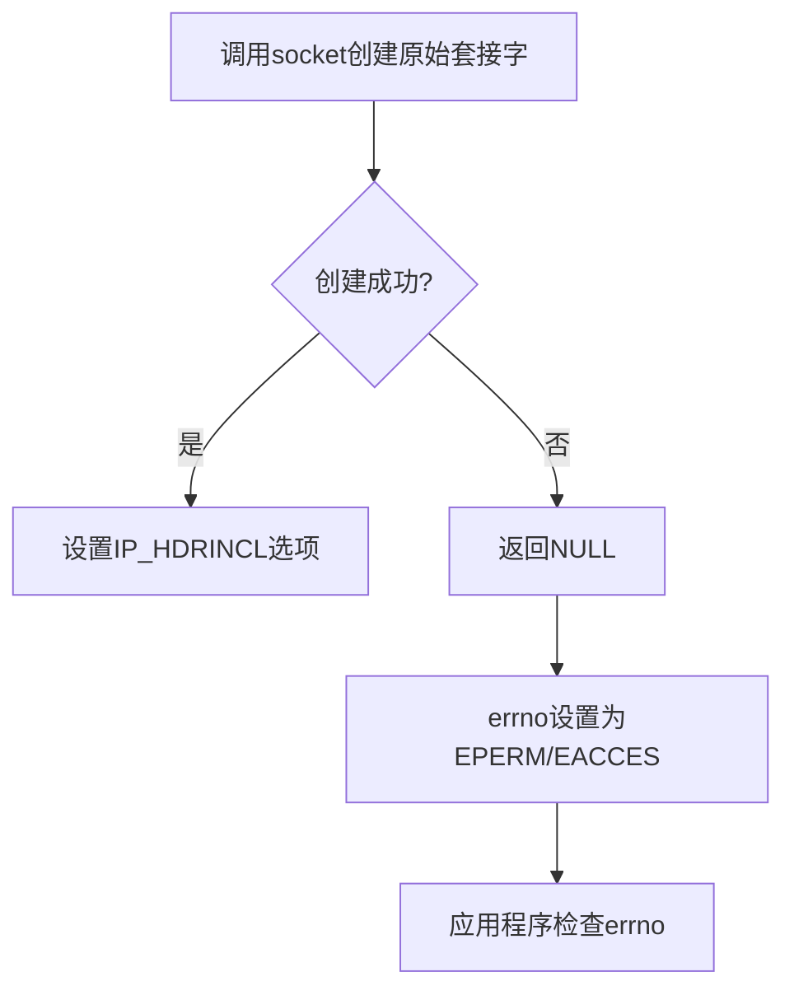

# libdnet 权限模型源码深入分析

## 目录
1. [权限模型概述](#权限模型概述)
2. [Linux平台权限实现](#linux平台权限实现)
3. [BSD/macOS平台权限实现](#bsdmacos平台权限实现)
4. [Windows平台权限实现](#windows平台权限实现)
5. [各平台权限对比](#各平台权限对比)
6. [权限错误处理](#权限错误处理)
7. [安全最佳实践](#安全最佳实践)

---

## 权限模型概述

libdnet 作为一个底层网络操作库，在多个平台上都需要执行特权操作。这些操作包括：
- 原始套接字创建（SOCK_RAW, PF_PACKET）
- 网络接口配置（SIOCGIFADDR, SIOCSIFADDR等ioctl）
- 路由表操作（SIOCADDRT, SIOCDELRT）
- 防火墙规则管理
- ARP缓存操作

### 权限需求分类

| 操作类型 | 权限要求 | 风险等级 |
|---------|---------|---------|
| 原始套接字 | root/CAP_NET_RAW | 高 |
| 接口配置 | root/CAP_NET_ADMIN | 高 |
| 路由操作 | root/CAP_NET_ADMIN | 中 |
| 防火墙规则 | root/CAP_NET_ADMIN | 高 |
| ARP操作 | root/CAP_NET_ADMIN | 中 |

---

## Linux平台权限实现

### 1. 原始套接字权限（ip.c）

Linux平台通过原始套接字实现IP层数据包发送：

```c
// src/ip.c:35
if ((i->fd = socket(AF_INET, SOCK_RAW, IPPROTO_RAW)) < 0)
    return (ip_close(i));
```

**权限分析**：
- `socket(AF_INET, SOCK_RAW, IPPROTO_RAW)` 需要：
  - **CAP_NET_RAW** 能力（Linux能力模型）
  - 或者有效的UID = 0（root用户）

**失败场景**：
```c
// 当权限不足时，socket()调用会失败并设置errno
// EPERM: 操作不允许，缺少CAP_NET_RAW能力
// EACCES: 权限被拒绝
```

**错误处理流程**：


### 2. 以太网套接字权限（eth-linux.c）

Linux使用PF_PACKET套接字访问二层网络：

```c
// src/eth-linux.c:49-50
if ((e->fd = socket(PF_PACKET, SOCK_RAW,
     htons(ETH_P_ALL))) < 0)
    return (eth_close(e));
```

**权限需求**：
- **CAP_NET_RAW**：捕获和发送原始数据包
- **CAP_NET_ADMIN**（部分操作）：修改混杂模式

**能力检查示例**：
```bash
# 检查进程能力
getpcaps <pid>

# 以特定能力运行程序
setcap cap_net_raw+ep /path/to/program
```

### 3. 路由表操作权限（route-linux.c）

Linux提供两种路由操作方式：ioctl和netlink。

#### 方法1：ioctl方式
```c
// src/route-linux.c:91
return (ioctl(r->fd, SIOCADDRT, &rt));

// src/route-linux.c:113
return (ioctl(r->fd, SIOCDELRT, &rt));
```

**权限需求**：
- **CAP_NET_ADMIN**：添加/删除路由表项

#### 方法2：netlink方式
```c
// src/route-linux.c:58-59
if ((r->nlfd = socket(AF_NETLINK, SOCK_RAW,
     NETLINK_ROUTE)) < 0)
    return (route_close(r));
```

**权限需求**：
- **CAP_NET_ADMIN**：通过netlink修改路由表

### 4. 接口配置权限（intf.c）

通过ioctl配置网络接口：

```c
// src/intf.c:340
if (ioctl(intf->fd, SIOCSIFADDR, &ifr) < 0 && errno != EEXIST)
    return (-1);

// src/intf.c:364
if (ioctl(intf->fd, SIOCSIFHWADDR, &ifr) < 0)
    return (-1);
```

**权限需求**：
- **CAP_NET_ADMIN**：配置IP地址、子网掩码、MAC地址等

### 5. ARP操作权限（arp-bsd.c/arp-ioctl.c）

```c
// src/arp-bsd.c:57
if ((arp->fd = socket(PF_ROUTE, SOCK_RAW, 0)) < 0)
    return (arp_close(arp));
```

**权限需求**：
- **CAP_NET_ADMIN**：修改ARP缓存

### 6. 防火墙规则权限（fw-ipfw.c, fw-ipchains.c）

```c
// src/fw-ipfw.c:190
if ((fw->fd = socket(AF_INET, SOCK_RAW, IPPROTO_IP)) < 0)
    return (fw_close(fw));

// src/fw-ipchains.c:120
if ((fw->fd = socket(AF_INET, SOCK_RAW, IPPROTO_RAW)) < 0)
    return (fw_close(fw));
```

**权限需求**：
- **CAP_NET_ADMIN**：管理防火墙规则

---

## BSD/macOS平台权限实现

### 1. 原始套接字权限（ip.c）

BSD平台的实现与Linux类似：

```c
// src/ip.c:35
if ((i->fd = socket(AF_INET, SOCK_RAW, IPPROTO_RAW)) < 0)
    return (ip_close(i));
```

**权限需求**：
- **root用户**（UID=0）
- BSD系统不使用Linux能力模型，必须以root运行

### 2. 以太网原始访问（eth-bsd.c）

BSD使用BPF（Berkeley Packet Filter）或PF_RAW：

```c
// src/eth-snoop.c:40（Solaris风格，但BSD类似）
if ((e->fd = socket(PF_RAW, SOCK_RAW, RAWPROTO_SNOOP)) < 0)
    return (eth_close(e));
```

**BSD特有方式 - BPF**：
```c
// BSD典型实现（不在libdnet中，但常见）
int fd = open("/dev/bpf0", O_RDWR);
ioctl(fd, BIOCSETIF, &ifr);
```

**权限需求**：
- root访问 `/dev/bpf*` 设备文件
- 设备文件权限通常为 `crw------- 1 root wheel`

### 3. 路由表操作（route-bsd.c）

```c
// src/route-bsd.c:205
if ((r->fd = socket(PF_ROUTE, SOCK_RAW, AF_INET)) < 0)
    return (route_close(r));
```

**权限需求**：
- **root用户**：通过PF_ROUTE套接字操作路由表

### 4. 接口配置（intf.c）

```c
// src/intf.c:398
if (ioctl(intf->fd, SIOCGIFFLAGS, &ifr) < 0)
    return (-1);

// src/intf.c:402
if (ioctl(intf->fd, SIOCSIFFLAGS, &ifr) < 0)
    return (-1);
```

**权限需求**：
- 读取操作（SIOCG*）：通常普通用户可执行
- 写入操作（SIOCS*）：需要root权限

### 5. ARP操作（arp-bsd.c）

```c
// src/arp-bsd.c:57
if ((arp->fd = socket(PF_ROUTE, SOCK_RAW, 0)) < 0)
    return (arp_close(arp));
```

**权限需求**：
- **root用户**：通过PF_ROUTE套接字操作ARP表

---

## Windows平台权限实现

Windows的权限模型与Unix系统完全不同，使用以下机制：
- 用户账户控制（UAC）
- 安全描述符（Security Descriptors）
- 特权令牌（Privilege Tokens）

### 1. IP层原始套接字（ip-win32.c）

```c
// src/ip-win32.c:35-43
if ((ip->fd = socket(AF_INET, SOCK_RAW, IPPROTO_RAW)) ==
    INVALID_SOCKET)
    return (ip_close(ip));

on = TRUE;
if (setsockopt(ip->fd, IPPROTO_IP, IP_HDRINCL,
    (const char *)&on, sizeof(on)) == SOCKET_ERROR) {
    SetLastError(ERROR_NETWORK_ACCESS_DENIED);
    return (ip_close(ip));
}
```

**权限分析**：
- Windows上 `SOCK_RAW` + `IPPROTO_RAW` 需要：
  - **管理员权限**（运行在提升的命令提示符）
  - Windows 7+：需要以管理员身份运行程序

**权限检查**：
```c
// Windows API权限检查示例
HANDLE hToken;
OpenProcessToken(GetCurrentProcess(), TOKEN_ADJUST_PRIVILEGES, &hToken);

LUID_AND_ATTRIBUTES privileges;
LookupPrivilegeValue(NULL, SE_LOAD_DRIVER_NAME, &privileges.Luid);
```

### 2. 路由操作（route-win32.c）

Windows使用IP Helper API：

```c
// src/route-win32.c:72-73
if (CreateIpForwardEntry(&ipfrow) != NO_ERROR)
    return (-1);

// src/route-win32.c:97-98
if (DeleteIpForwardEntry(&ipfrow) != NO_ERROR)
    return (-1);
```

**权限需求**：
- **管理员权限**：调用 `CreateIpForwardEntry` 和 `DeleteIpForwardEntry`

### 3. ARP操作（arp-win32.c）

```c
// src/arp-win32.c:46-47
if (CreateIpNetEntry(&iprow) != NO_ERROR)
    return (-1);

// src/arp-win32.c:66-68
if (DeleteIpNetEntry(&iprow) != NO_ERROR) {
    errno = ENXIO;
    return (-1);
}
```

**权限需求**：
- **管理员权限**：调用 `CreateIpNetEntry` 和 `DeleteIpNetEntry`

### 4. 网络接口操作（intf-win32.c）

Windows通过COM接口和IP Helper API：

```c
// 典型的Windows接口操作
GetAdaptersInfo();
GetIfEntry();
SetIfEntry();
```

**权限需求**：
- 读取操作（Get*）：通常普通用户可执行
- 写入操作（Set*）：需要管理员权限

### 5. Windows权限提升示例

libdnet本身不包含权限提升代码，但以下是应用程序可能使用的模式：

```c
// 检查是否以管理员身份运行
BOOL IsElevated() {
    HANDLE hToken;
    TOKEN_ELEVATION elevation;
    DWORD size;

    if (!OpenProcessToken(GetCurrentProcess(),
        TOKEN_QUERY, &hToken))
        return FALSE;

    if (!GetTokenInformation(hToken, TokenElevation,
        &elevation, sizeof(elevation), &size)) {
        CloseHandle(hToken);
        return FALSE;
    }

    CloseHandle(hToken);
    return elevation.TokenIsElevated != 0;
}
```

---

## 各平台权限对比

### 权限模型对比表

| 平台 | 权限模型 | 原始套接字 | 接口配置 | 路由操作 | 防火墙 |
|-----|---------|-----------|---------|---------|--------|
| Linux | POSIX + Capabilities | CAP_NET_RAW | CAP_NET_ADMIN | CAP_NET_ADMIN | CAP_NET_ADMIN |
| BSD/macOS | POSIX（仅root） | root | root | root | root |
| Windows | UAC + 令牌 | 管理员 | 管理员 | 管理员 | 管理员 |

### 权限检查方式对比

| 操作 | Linux | BSD/macOS | Windows |
|-----|-------|-----------|---------|
| 检查当前用户 | getuid() == 0 | getuid() == 0 | IsElevated() |
| 设置能力 | setcap | N/A | 重新以管理员运行 |
| 临时提权 | N/A | N/A | UAC提示 |

### 错误码对比

| 场景 | Linux | BSD/macOS | Windows |
|-----|-------|-----------|---------|
| 缺少原始套接字权限 | EPERM | EPERM | ERROR_NETWORK_ACCESS_DENIED |
| 缺少管理员权限 | EPERM | EPERM | ERROR_ACCESS_DENIED |
| 设备不存在 | ENOENT | ENOENT | ERROR_FILE_NOT_FOUND |

---

## 权限错误处理

### 1. Unix系统错误处理模式

libdnet使用标准的Unix错误处理模式：

```c
// src/ip.c:35-36
if ((i->fd = socket(AF_INET, SOCK_RAW, IPPROTO_RAW)) < 0)
    return (ip_close(i));
```

**调用者检查方式**：
```c
ip_t *ip = ip_open();
if (ip == NULL) {
    if (errno == EPERM) {
        fprintf(stderr, "需要CAP_NET_RAW权限或root权限\n");
    } else {
        perror("ip_open失败");
    }
}
```

### 2. Windows错误处理模式

```c
// src/ip-win32.c:42-43
if (setsockopt(ip->fd, IPPROTO_IP, IP_HDRINCL,
    (const char *)&on, sizeof(on)) == SOCKET_ERROR) {
    SetLastError(ERROR_NETWORK_ACCESS_DENIED);
    return (ip_close(ip));
}
```

**调用者检查方式**：
```c
ip_t *ip = ip_open();
if (ip == NULL) {
    DWORD error = GetLastError();
    if (error == ERROR_NETWORK_ACCESS_DENIED) {
        fprintf(stderr, "需要管理员权限\n");
    } else {
        fprintf(stderr, "错误: %d\n", error);
    }
}
```

### 3. 常见权限错误及解决方案

| 错误 | 场景 | Linux解决方案 | Windows解决方案 |
|-----|------|-------------|----------------|
| EPERM | 缺少原始套接字权限 | `sudo ./program` 或 `setcap cap_net_raw+ep` | 以管理员身份运行 |
| EACCES | 设备权限不足 | `chmod 666 /dev/bpf*` | 检查UAC设置 |
| EPERM | 无法添加路由 | `sudo` 或添加CAP_NET_ADMIN | 以管理员身份运行 |

---

## 安全最佳实践

### 1. 最小权限原则

**正确做法**：
```bash
# 只授予必要的权限
setcap cap_net_raw+ep /usr/local/bin/sniffer
```

**错误做法**：
```bash
# 授予过多权限
setcap cap_net_admin,cap_net_raw+ep /usr/local/bin/sniffer
```

### 2. 运行时权限检查

```c
#include <unistd.h>
#include <sys/capability.h>

// 检查是否有必要的Linux能力
int check_capabilities() {
    cap_t caps = cap_get_proc();
    if (!caps) return -1;

    cap_flag_value_t value;
    cap_get_flag(caps, CAP_NET_RAW, CAP_EFFECTIVE, &value);

    cap_free(caps);

    return (value == CAP_SET) ? 0 : -1;
}
```

### 3. 权限降级

在获得必要的特权后，应该尽快降级权限：

```c
// 示例：获取必要的权限后降级为非特权用户
void privilege_drop() {
    if (setuid(getuid()) < 0) {
        perror("setuid failed");
    }
    if (setgid(getgid()) < 0) {
        perror("setgid failed");
    }
}
```

### 4. 安全的权限请求提示

```c
// 在应用程序中提供清晰的错误信息
void report_permission_error(const char *operation) {
    fprintf(stderr, "错误: 执行 '%s' 需要额外权限\n", operation);
    fprintf(stderr, "\n");
    fprintf(stderr, "Linux解决方案:\n");
    fprintf(stderr, "  sudo %s\n", program_name);
    fprintf(stderr, "  或: setcap cap_net_raw+ep %s\n", program_name);
    fprintf(stderr, "\n");
    fprintf(stderr, "Windows解决方案:\n");
    fprintf(stderr, "  以管理员身份运行此程序\n");
}
```

### 5. 使用capabilities的完整示例

```bash
# 1. 编译程序
gcc -o mytool mytool.c -ldnet

# 2. 设置capabilities
sudo setcap cap_net_raw+ep ./mytool

# 3. 验证capabilities
getcap ./mytool
# 输出: ./mytool = cap_net_raw+ep

# 4. 普通用户运行
./mytool
# 不需要sudo即可运行

# 5. 移除capabilities
sudo setcap -r ./mytool
```

### 6. Windows安全注意事项

- 避免在程序中硬编码凭据
- 使用Windows服务而非交互式程序进行持续操作
- 考虑使用PowerShell脚本进行权限提升：
  ```powershell
  Start-Process -FilePath "mytool.exe" -Verb RunAs
  ```

---

## 附录：完整的权限检查示例程序

### Linux权限检查程序

```c
#include <stdio.h>
#include <unistd.h>
#include <sys/capability.h>
#include <errno.h>

int check_root() {
    return (getuid() == 0);
}

int check_cap_net_raw() {
    cap_t caps = cap_get_proc();
    if (!caps) return 0;

    cap_flag_value_t value;
    int ret = cap_get_flag(caps, CAP_NET_RAW, CAP_EFFECTIVE, &value);
    
    cap_free(caps);

    return (ret == 0 && value == CAP_SET);
}

int main() {
    printf("libdnet权限检查工具\n");
    printf("===================\n\n");

    printf("当前UID: %d\n", getuid());
    printf("当前EUID: %d\n", geteuid());

    if (check_root()) {
        printf("状态: 以root用户运行\n");
    } else {
        printf("状态: 普通用户\n");
    }

    if (check_cap_net_raw()) {
        printf("CAP_NET_RAW: ✓ 拥有\n");
    } else {
        printf("CAP_NET_RAW: ✗ 缺少\n");
        printf("解决方案: sudo setcap cap_net_raw+ep ./mytool\n");
    }

    return 0;
}
```

### Windows权限检查程序

```c
#include <windows.h>
#include <stdio.h>

BOOL IsElevated() {
    HANDLE hToken;
    TOKEN_ELEVATION elevation;
    DWORD size;

    if (!OpenProcessToken(GetCurrentProcess(),
        TOKEN_QUERY, &hToken))
        return FALSE;

    if (!GetTokenInformation(hToken, TokenElevation,
        &elevation, sizeof(elevation), &size)) {
        CloseHandle(hToken);
        return FALSE;
    }

    CloseHandle(hToken);
    return elevation.TokenIsElevated != 0;
}

int main() {
    printf("libdnet Windows权限检查工具\n");
    printf("===========================\n\n");

    if (IsElevated()) {
        printf("状态: ✓ 以管理员身份运行\n");
        printf("可以执行所有libdnet操作\n");
    } else {
        printf("状态: ✗ 普通用户权限\n");
        printf("解决方案: 右键点击程序 -> 以管理员身份运行\n");
        printf("\n受限操作:\n");
        printf("  - 原始套接字创建\n");
        printf("  - 路由表修改\n");
        printf("  - 防火墙规则管理\n");
    }

    return 0;
}
```

---

## 总结

libdnet的权限模型跨平台设计确保了在不同操作系统上的一致性，同时尊重各平台的安全模型：

1. **Linux**：采用capabilities模型，支持细粒度的权限控制
2. **BSD/macOS**：使用传统的root权限模型
3. **Windows**：基于UAC和令牌的管理员权限

开发使用libdnet的应用程序时，应该：
- 在代码中检查权限并给出清晰的错误提示
- 遵循最小权限原则
- 提供详细的权限配置说明
- 考虑使用capabilities而不是直接要求root权限（Linux）

通过合理处理权限问题，libdnet应用程序可以在保证安全性的前提下，充分利用其强大的底层网络操作能力。
